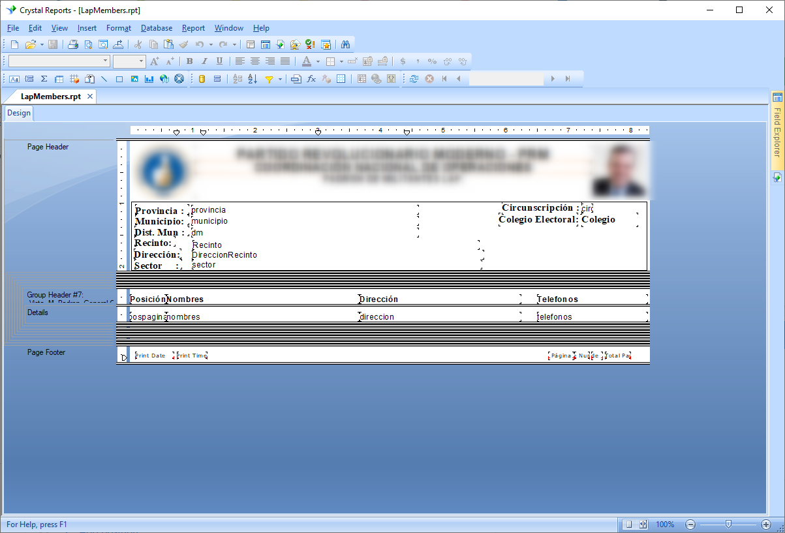

# Converts Crystal Reports To pdf

The **goal** is to develop and maintain a desktop application to automatically generate pdf files with the personal information of Dominican citizens.

##### Technology used:
* IDE: **Visual studio 2015**
* Language: **C# desktop application**
* Report template: **Crystal Reports.**
* Database: **MS SQL SERVER 2008, T-SQL (views, store procedure)**

To perform this task, I created a template in Crystal Reports to display information such as the name, address, photo, etc, of each citizen of the Dominican Republic.

The information was obtained from a database in SQL Server that was provided to me. The reports had to be stored in folders divided by province, municipality, and rural area.

For the database connection, I used **ADO.net.**

##### Screenshots of the system

